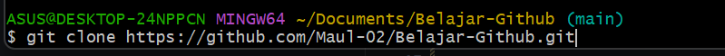

# Belajar-Github

1. Pentingnya Penggunaan Command Line
   - Meskipun banyak aplikasi Git desktop (seperti GitHub Desktop atau GitKraken), CLI tetap menjadi standar industri karena beberapa alasan:
   1. Kecepatan dan Efisiensi: Setelah hafal perintahnya, mengetik seringkali lebih cepat daripada navigasi menu klik.
   2. Akses Fitur Penuh: Beberapa perintah Git tingkat lanjut hanya tersedia melalui CLI.
   3. Otomatisasi (Scripting): Perintah CLI dapat dimasukkan ke dalam skrip untuk otomatisasi proses deployment (CI/CD).
   4. Universal: CLI bekerja di hampir semua server (seperti Linux server) yang tidak memiliki antarmuka grafis.

2. Langkah-langkah push repository
   
   Langkah-Langkah Push Repository (Pertama Kali)
   Gunakan langkah ini saat Anda memiliki proyek lokal di komputer dan ingin mengunggahnya ke repositori daring (seperti GitHub/GitLab) untuk pertama kalinya.

- Inisialisasi Git: Masuk ke folder proyek dan aktifkan Git.
  git init

- Menambahkan File: Pilih file yang ingin dilacak.
  git add . (Tanda titik berarti menambahkan semua file).

- Simpan Perubahan (Commit): Berikan catatan pada perubahan tersebut.
  git commit -m "Initial commit"

- Hubungkan ke Remote: Sambungkan folder lokal dengan URL repositori daring.
  git remote add origin [URL_REPOSITORY]

- Kirim Data (Push): Unggah file ke server.
  git push -u origin main (Ganti main dengan nama branch Anda jika berbeda).

<b>
ATAU
</b>
- git add .
- git commit -m "subjek"
- git push origin main

3. Langkah-Langkah Clone Repository
   Gunakan langkah ini jika Anda ingin mengambil salinan proyek yang sudah ada di server ke komputer lokal Anda.

   
   

- Cari URL Repositori: Salin URL (HTTPS/SSH) dari penyedia repositori (misal GitHub).

- Eksekusi Clone: Buka terminal dan ketik perintah berikut:
  git clone [URL_REPOSITORY]

- Masuk ke Folder: Pindah ke direktori hasil kloning.
  cd [NAMA_FOLDER]

4. Langkah-Langkah Pull dan Push (Update Rutin)

   Setelah repositori terhubung (setelah proses nomor 2 atau 3), inilah alur kerja harian Anda untuk menjaga sinkronisasi data.

Proses Pull (Mengambil Update dari Server)
Lakukan ini sebelum mulai bekerja agar Anda mendapatkan versi terbaru dari rekan tim.

- Ambil data: git pull origin main

Proses Push (Mengirim Update Baru)
Lakukan ini setelah Anda selesai melakukan perubahan pada kode.

- Cek Status: Pastikan file mana saja yang berubah.
  git status

- Tahapan (Staging): Pilih file yang akan diunggah.
  git add .

- Commit: Beri label pada perubahan.
  git commit -m "Penjelasan singkat perubahan"

- Push: Kirim ke server.
  git push origin main
